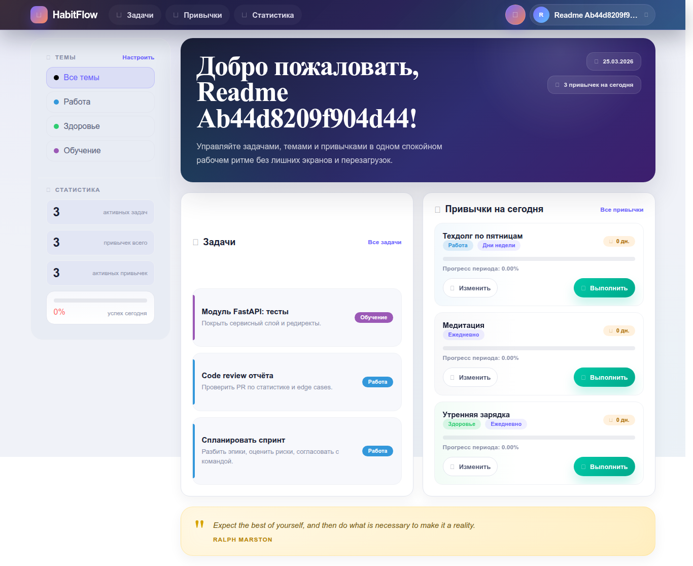
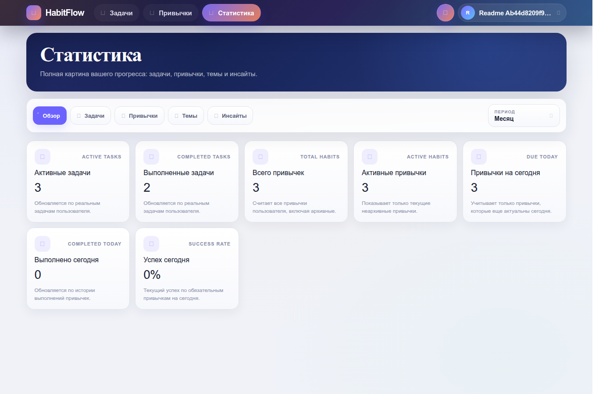
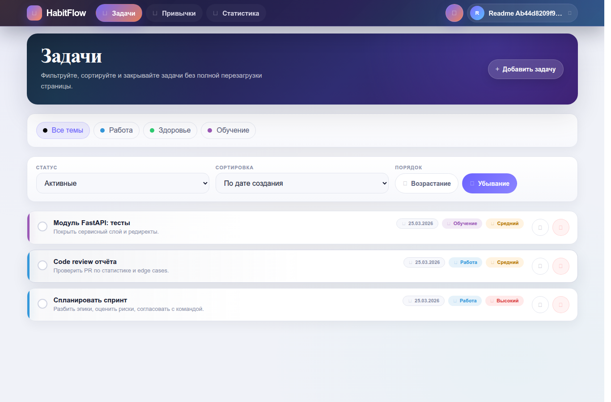
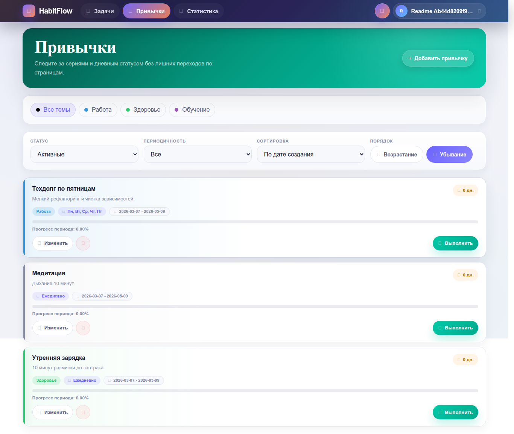
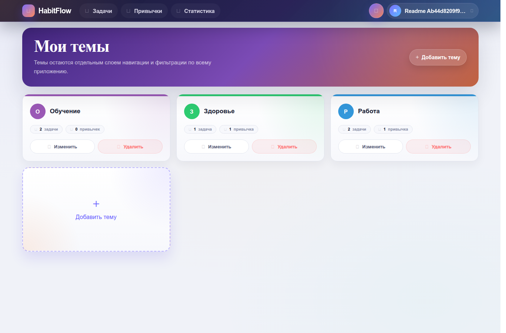

# HabitFlow

[](https://github.com/Qwertyil/HabitFlow/actions/workflows/ci.yml)
[](https://github.com/Qwertyil/HabitFlow/actions/workflows/codeql.yml)
[](https://codecov.io/gh/Qwertyil/HabitFlow)
[](https://www.python.org/)
[](https://fastapi.tiangolo.com/)
[](https://www.docker.com/)

**A web-first habit and task tracker with flexible recurring schedules, progress reporting, and secure user-scoped data.**

HabitFlow helps users organize themes, tasks, and recurring habits in one FastAPI application. It combines a server-rendered browser interface with date-aware scheduling, streak tracking, authentication, statistics, and containerized local development.

> [!IMPORTANT]
> **Live demo: currently disabled.** The hosted instance is offline, but the complete application can be run locally with Docker Compose using the quick start below.

<p align="center">
  
</p>

## Engineering Highlights

| Area | Implementation |
|---|---|
| Domain modeling | Daily, weekday, monthly, yearly, and interval-based habit schedules with start/end windows, due-today logic, completion history, streaks, and automatic expiry |
| Secure ownership | Owner-scoped repositories prevent one user from reading or mutating another user's themes, tasks, habits, or statistics |
| Authentication | Argon2 password hashing, opaque Redis-backed sessions, logout/invalidation, and optional Google OAuth |
| Browser security | CSRF validation, safe redirect normalization, auth rate limits, cookie controls, CSP, and other security headers |
| Architecture | Explicit `routers -> services -> repositories` boundaries around PostgreSQL and Redis |
| Reliability | Alembic migrations, health/readiness checks, structured logs, request IDs, Docker packaging, and a standalone scheduled worker |
| Verification | Unit, API-unit, and integration tests with an enforced 80% coverage floor, plus Ruff, strict mypy, migration checks, CodeQL, dependency auditing, container scanning, and Docker smoke tests in CI |

## Product Capabilities

- Group work into themes and track related task and habit counts.
- Create tasks with priorities and explicit completion state.
- Schedule habits daily, on selected weekdays, monthly, yearly, or on custom interval cycles.
- Track completions, current streaks, period progress, habits due today, and expired habits.
- Explore aggregated task, habit, and theme statistics over selectable periods.
- Register and sign in with email/password or optional Google OAuth.
- Use a responsive server-rendered interface with light/dark themes and targeted fetch-based updates.
- Refresh motivational quotes in a dedicated APScheduler worker rather than the web process.

## Architecture

```text
Browser
  -> FastAPI application
     -> middleware (request context, sessions, security headers)
     -> routers (HTML, redirects, targeted JSON responses)
        -> services (business rules and use-case orchestration)
           -> repositories
              -> PostgreSQL (application data and reporting)
              -> Redis (authentication sessions)

Quote worker
  -> APScheduler
     -> quote service
        -> ZenQuotes API
        -> PostgreSQL
```

The request path is deliberately explicit: routers own HTTP concerns, services own product rules, and repositories own persistence. That separation keeps date-sensitive behavior and authorization boundaries testable without coupling them to FastAPI handlers.

### Deliberate Trade-offs

| Decision | Why it fits this project | Cost accepted |
|---|---|---|
| Redis-backed opaque sessions instead of JWTs | Immediate logout and server-side invalidation with a small, inspectable auth model | Redis becomes a runtime dependency |
| Server-rendered Jinja2 UI instead of a SPA | Keeps browser flows cohesive and avoids a separate frontend deployment | Less client-side interactivity than a dedicated frontend |
| APScheduler worker instead of a queue stack | Isolates lightweight recurring quote refreshes without introducing Celery and a broker | Not intended for high-volume distributed jobs |
| Layered services and repositories | Makes business rules, ownership checks, and persistence independently testable | More structure than a small CRUD prototype needs |

## Where to Start in the Code

| Topic | Code | Tests / notes |
|---|---|---|
| Recurring-habit rules and statistics | [`src/services/habits.py`](src/services/habits.py) | [`tests/unit/test_habit_service.py`](tests/unit/test_habit_service.py), [`tests/integration/test_habits.py`](tests/integration/test_habits.py) |
| Owner-scoped persistence | [`src/repositories/owned_base.py`](src/repositories/owned_base.py) | Integration coverage across themes, tasks, habits, and statistics |
| Authentication and sessions | [`src/services/auth/`](src/services/auth/), [`src/repositories/session_store.py`](src/repositories/session_store.py) | [`docs/session_contract.mdc`](docs/session_contract.mdc) |
| Application lifecycle and middleware | [`src/application.py`](src/application.py), [`src/lifespan.py`](src/lifespan.py), [`src/middleware/`](src/middleware/) | Health, request-context, security-header, and lifecycle tests |
| Delivery pipeline | [`.github/workflows/ci.yml`](.github/workflows/ci.yml) | Lint, coverage, migrations, image build, security scans, and a running-container smoke test |

## Technology

- **Backend:** Python 3.12, FastAPI, Pydantic, SQLAlchemy 2.x, Alembic
- **Data:** PostgreSQL 17, Redis 7
- **Web:** Jinja2, semantic CSS, vanilla JavaScript
- **Background work:** APScheduler, HTTPX, standalone worker process
- **Quality:** pytest, pytest-cov, Ruff, mypy, pre-commit, CodeQL
- **Delivery:** Docker, Docker Compose, GitHub Actions

## Run Locally

### Docker Compose Quick Start

Prerequisites: Git, Docker, and Docker Compose.

```bash
git clone https://github.com/Qwertyil/HabitFlow.git
cd HabitFlow
cp .env.example .env
cp .env.docker.example .env.docker
make compose-up
make migration
```

Open [http://localhost:8001](http://localhost:8001). The development stack starts the web application, quote worker, PostgreSQL, and Redis.

Stop it with:

```bash
make compose-down
```

### Native Python Development

Use Docker for PostgreSQL and Redis while running the Python processes locally:

```bash
cp .env.example .env
poetry install
make infra-up
poetry run alembic upgrade head
make run
```

Run the quote worker in a second terminal when you want scheduled quote refreshes:

```bash
make worker-run
```

Google OAuth is optional. To enable it locally, provide the `GOOGLE_OAUTH_*` values in `.env` and keep the callback URL set to `http://localhost:8001/auth/google/callback`.

## Quality Checks

```bash
make lint
make typecheck
make test
```

The suite is split into three layers:

- `tests/unit` covers isolated business and infrastructure logic.
- `tests/api_unit` covers route contracts and browser response behavior.
- `tests/integration` exercises the application against disposable PostgreSQL and Redis containers.

Docker is required for the integration layer. `make test` measures branch coverage and fails below 80%.

## Project Structure

```text
.
├── src/
│   ├── routers/          # HTTP and browser-facing routes
│   ├── services/         # domain logic and use cases
│   ├── repositories/     # PostgreSQL and Redis access
│   ├── database/         # SQLAlchemy models and Alembic migrations
│   ├── schemas/          # Pydantic input/output contracts
│   ├── middleware/       # request context and security headers
│   ├── templates/        # Jinja2 views
│   └── static/           # CSS and JavaScript
├── tests/
│   ├── unit/
│   ├── api_unit/
│   └── integration/
├── docs/                 # architecture and HTTP/session contracts
├── scripts/              # README screenshot tooling
├── docker-compose.yml
├── docker-compose.dev.yml
├── Dockerfile
└── Makefile
```

## Screenshots

<p align="center">
  
</p>

<details>
  <summary>View task, habit, and theme screens</summary>

  <p align="center">
    
  </p>

  <p align="center">
    
  </p>

  <p align="center">
    
  </p>
</details>

The screenshots use generated demo data. They can be refreshed with [`scripts/capture_readme_screenshots.py`](scripts/capture_readme_screenshots.py) against a running local instance.

## Documentation

- [`docs/overview.mdc`](docs/overview.mdc) — product scope and architectural principles
- [`docs/api_contract.mdc`](docs/api_contract.mdc) — routes, payloads, responses, auth, and CSRF behavior
- [`docs/session_contract.mdc`](docs/session_contract.mdc) — UI session and Redis-backed auth session lifecycle

## Current Scope

HabitFlow currently focuses on personal productivity through its browser interface. A separate public REST API, multi-user collaboration, an admin panel, and mobile clients are outside the current scope. These boundaries keep the application centered on recurring-habit logic, security, and maintainability.
